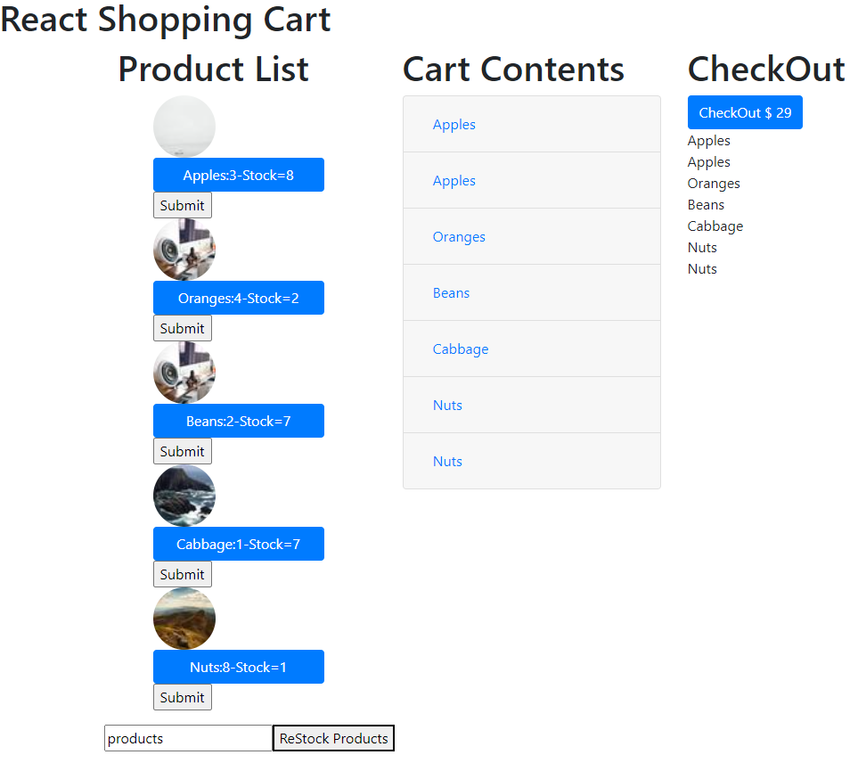

# Shopping Cart

## Description 
This is a simple Shopping Cart using react to create and manage a shopping list and inventory. A list of items sold are presented as buttons with the correlating stock next to it.

## Purpose 
This was done as an assignment in the MIT course - Full Stack Development with Mern

---------

## Technologies Used 
- HTML
- CSS
- Javascript

---------

## Installation 
- Clone this repository to your local machine
- Open a command line on your computer and run the command cd path-to-project-root (this should be the actual directory where the repository is located on your local machine)
- Within the same command-line window, run npm install http-server which will allow you to fire up a web server to access the paage
- Once the command completes successfully, run http-server -c-1
- Open your browser of choice and browse to http://127.0.0.1:8080/

## How to Run 
- When the page is loaded in your browser, you will notice default entries of items sold
- To add an item to your shopping cart: Click on the button of an entry. If there is a 0 next to the entry, the item will not be added to your cart. If there is not a zero next to the entry, the item will be added to your cart and the inventory of that item will be reduced by one.

---------

## Files 
- **/Standalone** - Standalone React App
  - **/index.html** - Start-up file to be opened by browser
  - **/cart.js** - Contains the React code to build the stores items, the code to manage the inventory, the code to manage the shopping cart, and Render ReactDOM
  - **/shoppingCart.png** - Screenshot for Readme
- **/Create-React-App** - React App
  - **/public/index.html** - Start-up file to be opened by browser
  - **/src/App.css** - Stylesheet file that positions objects, controls text, colors, and layout
  - **/src/App.js** - Contains the React code to build the stores items, the code to manage the inventory, the code to manage the shopping cart, and Render ReactDOM
  - **/src/index.css** - Stylesheet file that positions objects, controls text, colors, and layo
  - **/src/index.js** - Contains the ReactDom
  - **/src/Components/products.jsx** - Contains the React code to build the stores items, the code to manage the inventory, the code to manage the shopping cart, and Render ReactDOM

---------

## Contributing 
Pull requests are welcome. For major changes, please open an issue first to discuss what you would like to change.

## License
[The MIT License (MIT)](https://github.com/slumpbuster/Formik/blob/main/LICENSE)
